# Gully Erosion Susceptibility Modelling in Benin Metropolis Using Random Forest

## Project overview

This project applies **remote sensing, GIS and machine learning** to model gully-erosion susceptibility across **Benin Metropolis, Edo State, Nigeria**.

The analysis integrates terrain, vegetation, rainfall, soil, land-cover and proximity information with a labelled gully inventory. A **Random Forest** model was trained to learn the non-linear relationships between known gully occurrence and the surrounding environmental conditions, and the fitted model was then used to produce a spatial susceptibility map.

The study covers the metropolitan core of **Oredo, Egor and Ikpoba Okha LGAs**.

## Key result

The final Random Forest model achieved:

- **AUC-ROC:** 0.92
- **Overall accuracy:** 89.50%
- **Cohen's kappa:** 0.79
- **Gully-class precision:** 0.89
- **Gully-class recall:** 0.92
- **Gully-class F1-score:** 0.90

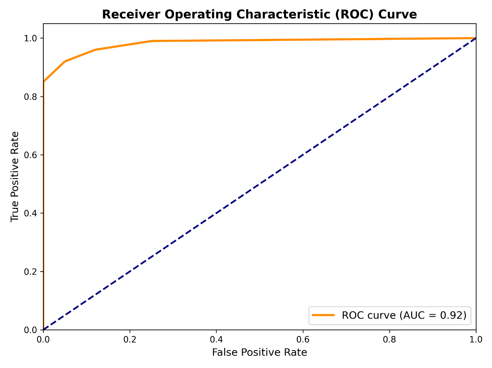

## Study area

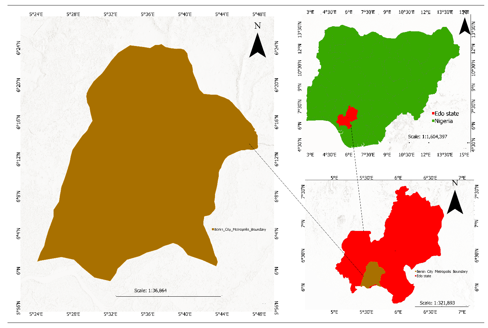

The project focused on the urban and peri-urban Benin metropolitan area and modelled susceptibility across the three core LGAs.

## Data and modelling workflow

```text
Multi-source geospatial data
        ↓
Preprocessing and factor derivation
        ↓
Gully-presence / absence inventory
        ↓
Extract predictor values at labelled points
        ↓
Random Forest
        ↓
5-fold stratified cross-validation
        ↓
Cross-validated diagnostics + ROC-AUC
        ↓
Fit full labelled dataset
        ↓
Spatial probability prediction
        ↓
Spatial probability prediction
        ↓
Gully-susceptibility map
```

### Main data streams

| Data stream | Example source / role |
|---|---|
| Terrain | SRTM DEM for elevation and terrain derivatives |
| Multispectral imagery | Sentinel-2 for NDVI and land-cover information |
| Climate and soil | Rainfall and soil-property layers |
| Human / proximity factors | Road-distance information |
| Gully inventory | Literature, Google Earth imagery and field GPS coordinates |

## Google Earth Engine preprocessing code

The repository includes the original GEE extraction script used for the preprocessing stage:

[`gee/benin_metropolis_master_extraction.js`](gee/benin_metropolis_master_extraction.js)

That script constructs the three-LGA Benin Metropolis boundary and exports nine raster inputs: **Elevation, Slope, Aspect, TWI, NDVI, LULC, Rainfall, Sand and Clay**.

The final model contains additional predictors prepared later in the workflow, so the preprocessing exports and final model-input list are documented separately rather than being treated as the same thing.

## Ground-truth / training inventory

The project reports a balanced inventory of:

- **120 gully-presence points**
- **120 gully-absence points**

Presence locations were compiled using **historical scientific literature, high-resolution Google Earth imagery and direct field GPS coordinate surveys**. Stable-terrain locations were used as the contrasting absence class.

The supplied Python implementation evaluates the labelled dataset using **5-fold stratified cross-validation**. Cross-validated class predictions and probabilities are used to calculate the confusion matrix, classification report and ROC-AUC.

## Final model predictors

The completed written report refers to 13 conditioning factors in several places. The **final variable-importance output displays 12 predictors**, while the supplied Python script dynamically trains on **every `.tif` file present in the workspace** rather than hard-coding a predictor list.

For portfolio documentation, the final variable-importance chart is therefore used to describe the predictors represented in the reported final model output:

1. Rainfall
2. NDVI
3. Clay
4. Elevation
5. Sand fraction
6. LULC
7. TWI
8. Slope
9. SPI
10. Plan curvature
11. Aspect
12. Distance to road

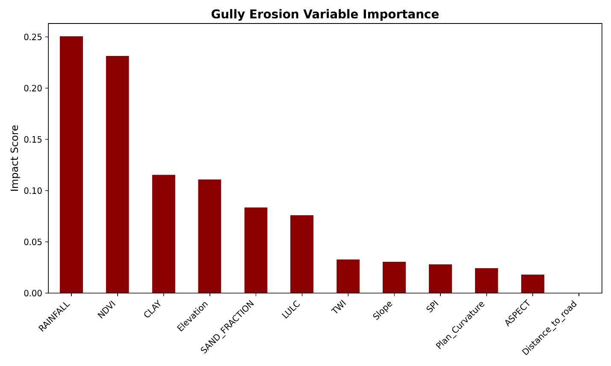

The final importance result identifies **rainfall and NDVI as the two strongest individual predictors**, followed by soil and terrain variables.

## Conditioning-factor outputs

### Aspect

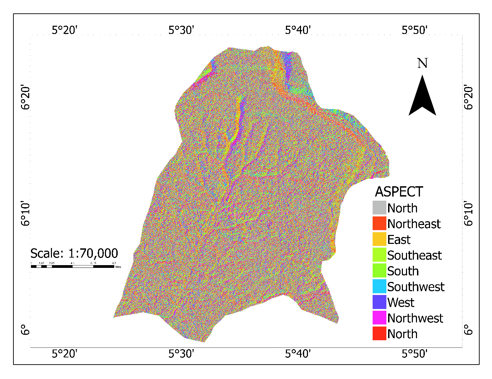

### Clay fraction

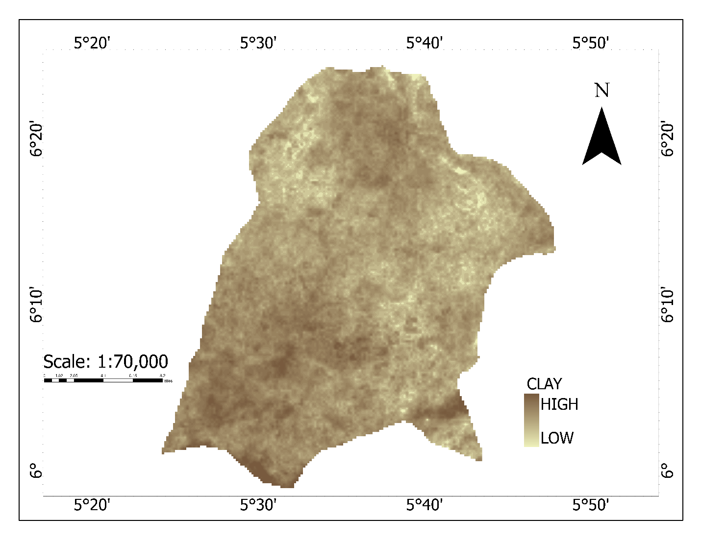

### Elevation

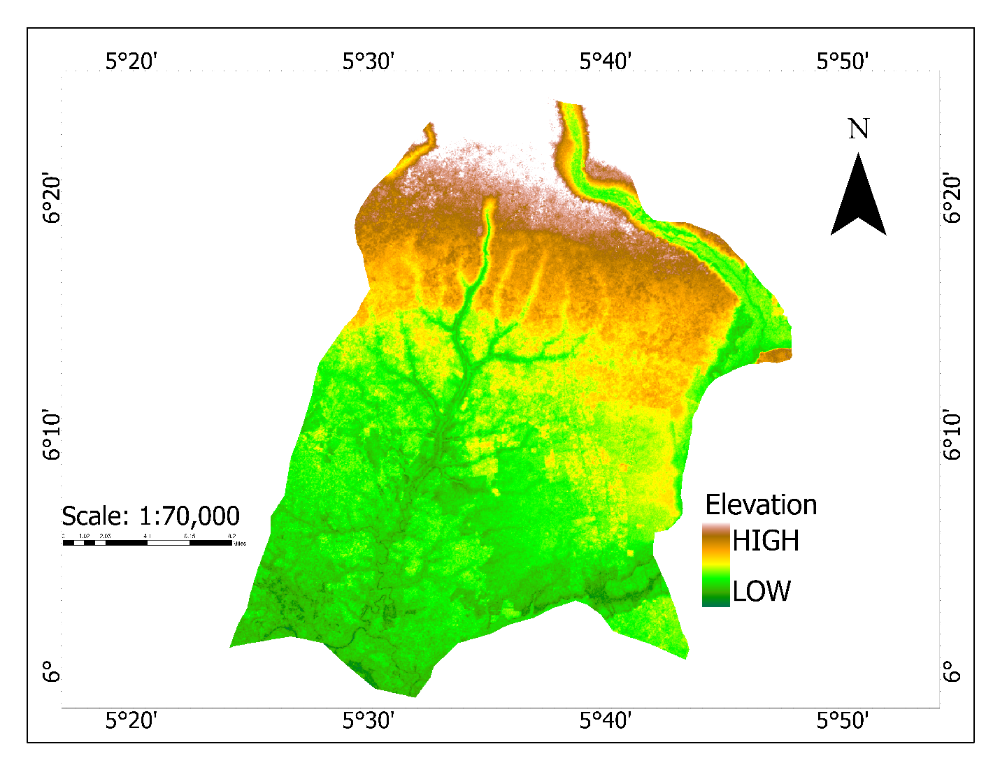

Elevation in the project results ranges from approximately **-3 m to 126 m**.

### Sand fraction

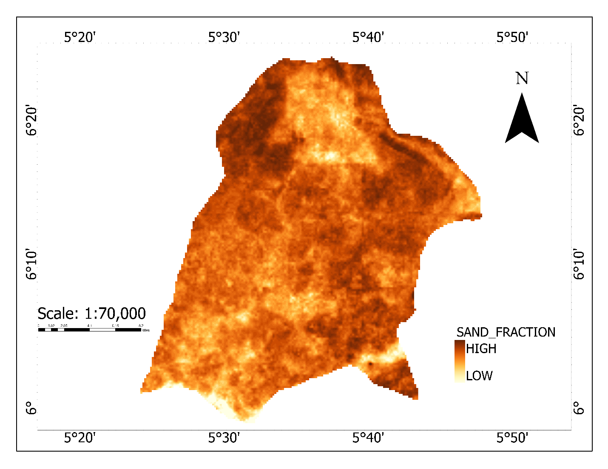

### Slope

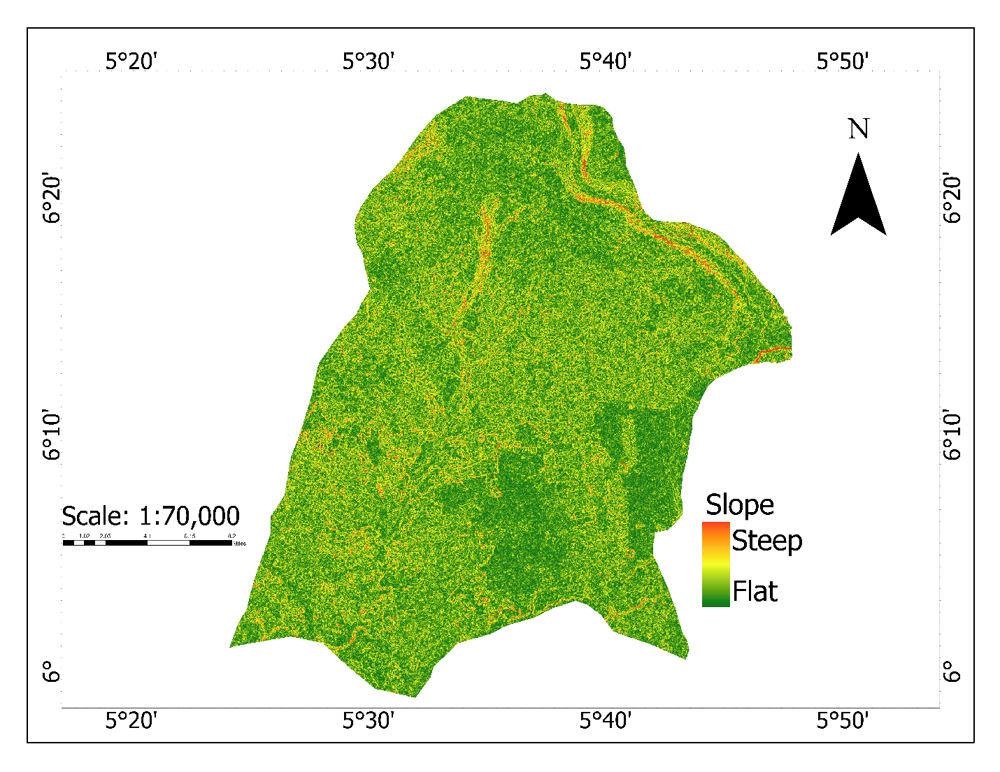

Most of the mapped terrain is relatively flat to undulating, while locally steeper sections occur along drainage and incised terrain.

### NDVI

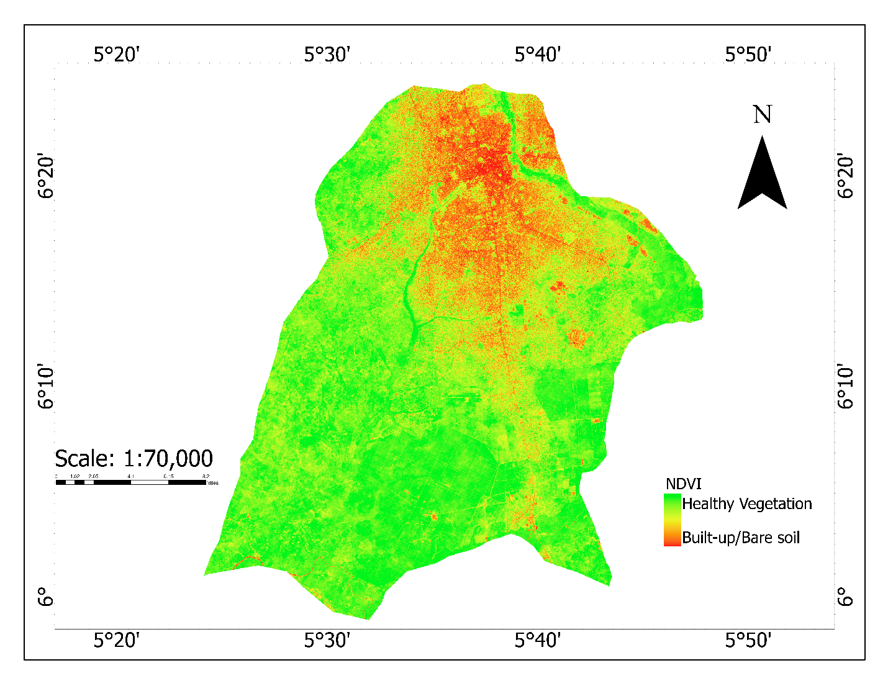

The reported NDVI range is approximately **-0.3 to 0.8**, representing built/bare surfaces through to denser vegetation.

### Plan curvature

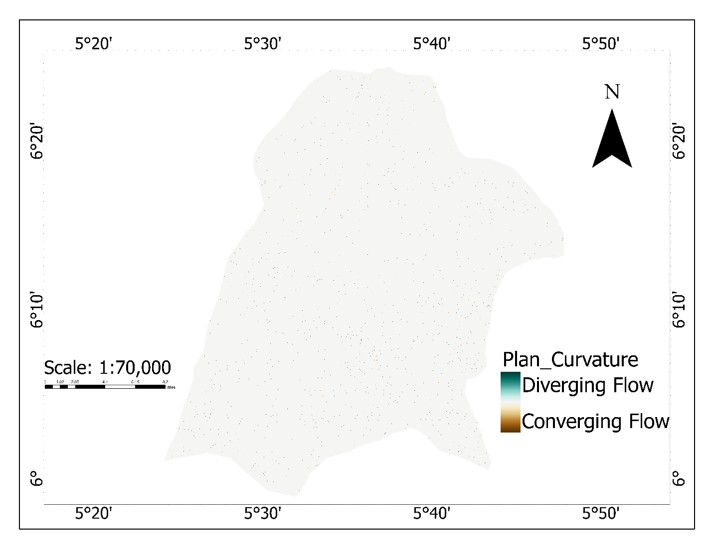

### Rainfall

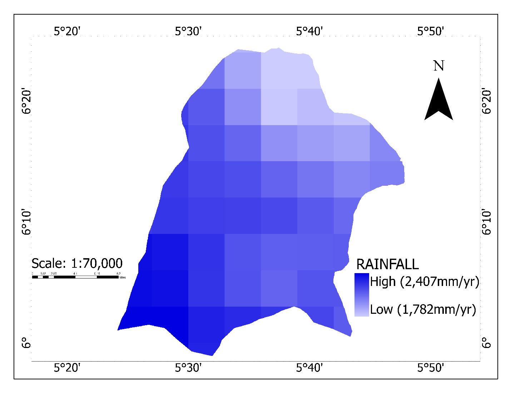

The project used a reported 2016-2025 rainfall average ranging from approximately **1,782 to 2,407 mm/year** across the study area.

### Stream Power Index (SPI)

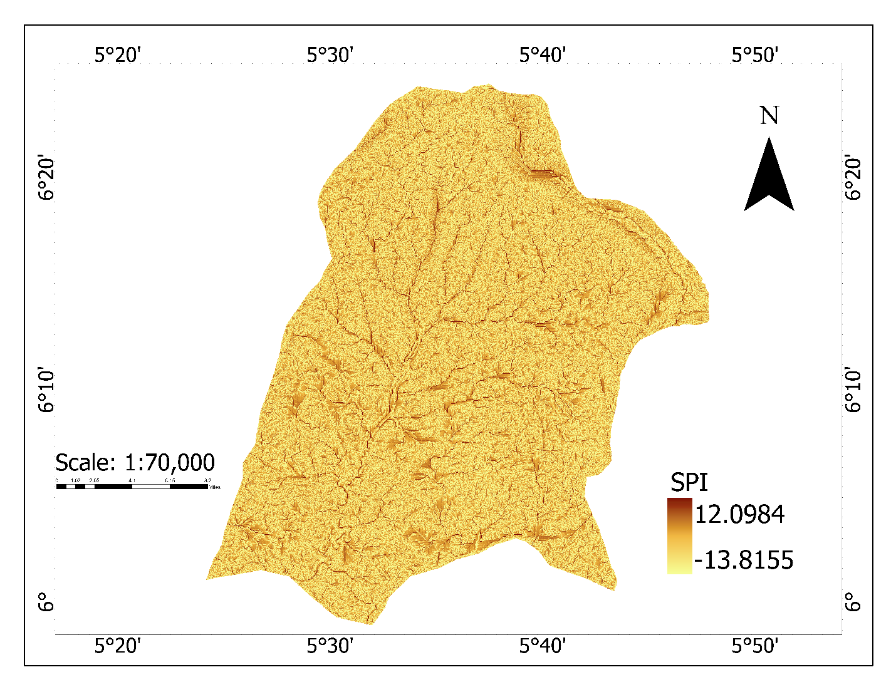

### Topographic Wetness Index (TWI)

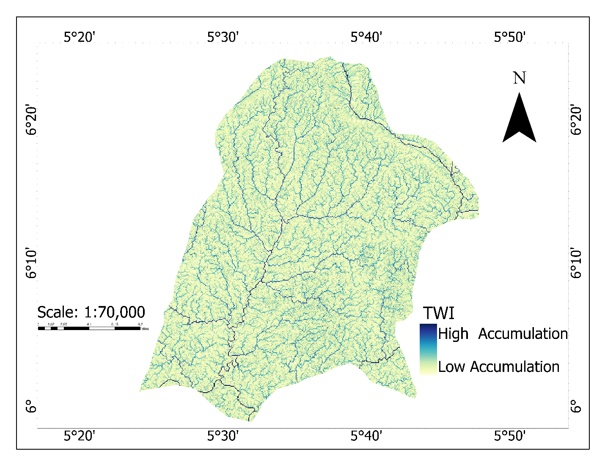

## Python model implementation

The original Colab/Python modelling script is included at:

[`python/random_forest_susceptibility_model.py`](python/random_forest_susceptibility_model.py)

The actual implementation uses:

```python
RandomForestClassifier(
    n_estimators=500,
    max_depth=3,
    min_samples_leaf=4,
    max_features='sqrt',
    random_state=42
)
```

with:

```python
StratifiedKFold(n_splits=5, shuffle=True, random_state=42)
```

The script uses `cross_val_score` and `cross_val_predict` for validation, computes ROC-AUC from cross-validated probabilities, then fits the model on the full labelled dataset to create the continuous susceptibility raster.

It also uses Rasterio to align rasters whose dimensions differ before applying the fitted model across the study area.

## Final susceptibility map

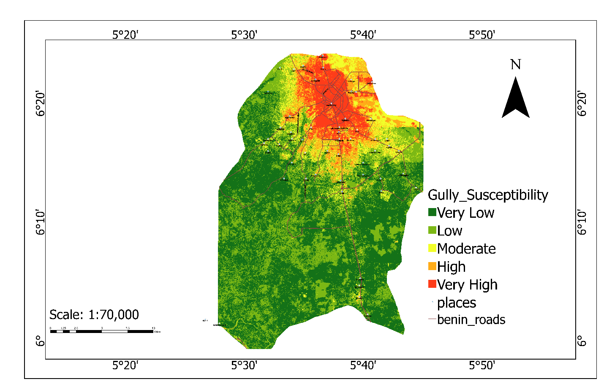

The final map classifies the model output into:

- Very Low
- Low
- Moderate
- High
- Very High susceptibility

Higher-susceptibility areas were interpreted in relation to concentrated runoff pathways, slope transitions, exposed/low-vegetation surfaces, soil conditions and urban drainage effects.

## Model performance

| Class / metric | Result |
|---|---:|
| Stable-terrain precision | 0.91 |
| Stable-terrain recall | 0.88 |
| Stable-terrain F1 | 0.89 |
| Gully precision | 0.89 |
| Gully recall | 0.92 |
| Gully F1 | 0.90 |
| Overall accuracy | **89.50%** |
| Cohen's kappa | **0.79** |
| AUC-ROC | **0.92** |

The strong gully recall is particularly useful for susceptibility screening because it indicates that the fitted model captured a high proportion of the labelled gully locations in the evaluation data.

## Research contribution

The project moves beyond site-by-site description of individual gullies and develops a **metropolis-scale predictive susceptibility model**. It combines Earth-observation data, terrain analysis, field-supported inventory information and machine learning within one spatial modelling workflow.

The resulting map is intended as a **decision-support layer** for identifying areas that may warrant closer investigation, drainage intervention, development control or higher-resolution field assessment.

## Limitations

- The susceptibility map predicts **relative likelihood**, not the exact time or magnitude of future gully failure.
- The model is dependent on the quality and spatial representativeness of the gully inventory and predictor layers.
- Terrain modelling relies partly on **30 m SRTM elevation data**, which cannot capture all micro-topographic features relevant to gully initiation.
- Predictor datasets originate from different spatial resolutions and sources.
- Five-fold random stratified cross-validation provides useful predictive validation, but it does not fully test geographic transferability to completely separate spatial areas.
- The project does not perform geotechnical slope-stability analysis, subsurface soil testing or engineering design of erosion-control structures.
- Higher-resolution UAV, LiDAR or field-survey data could improve future micro-topographic modelling.

## Implementation note

The repository now contains the **original GEE preprocessing code and original Python/Colab Random Forest code supplied for the project**. Where the narrative thesis methodology and the executable code differ, the code sections in this repository describe what the supplied scripts actually implement. In particular, the Python script uses fixed Random Forest parameters and 5-fold stratified cross-validation; it does not implement a 70/30 split or GridSearchCV.

## Repository structure

```text
gully-erosion-susceptibility-benin/
├── README.md
├── .gitignore
├── gee/
│   ├── benin_metropolis_master_extraction.js
│   └── README.md
├── python/
│   ├── random_forest_susceptibility_model.py
│   └── README.md
├── workflow/
│   └── README.md
└── outputs/
    ├── maps/
    │   ├── study_area.png
    │   ├── aspect.png
    │   ├── clay_fraction.png
    │   ├── elevation.png
    │   ├── sand_fraction.png
    │   ├── slope.png
    │   ├── ndvi.png
    │   ├── plan_curvature.png
    │   ├── rainfall.png
    │   ├── spi.png
    │   ├── twi.png
    │   └── gully_susceptibility.png
    ├── figures/
    │   ├── roc_auc_curve.png
    │   └── variable_importance.png
    └── tables/
        ├── final_model_predictors.csv
        ├── gully_inventory_summary.csv
        └── model_performance.csv
```

## Tools and methods

**Google Earth Engine · GIS · Remote Sensing · SRTM · MERIT Hydro · Sentinel-2 · ESA WorldCover · CHIRPS · OpenLandMap · Google Earth · GPS Field Verification · Python · scikit-learn · Random Forest · ROC-AUC · Spatial Susceptibility Modelling**

---

**Joy Ugbogbo**  
GIS & Remote Sensing Analyst | Spatial Data Science
